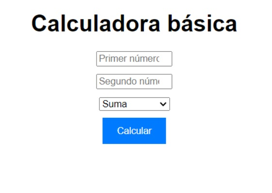

# Calculadora básica
- Versión: 0.4
- Autor: **Cristina**
- Licencia: MIT



## Descripción de la aplicación:
Esta aplicación tiene como intención hacer una calculadora básica
## Instalación
Para instalar tienes dos opciones:

La primera opción es descarga el zip de la siguiente url:
[https://github.com/Crisbm9/calculadorabasica.git](https://github.com/Crisbm9/calculadorabasica.git)

O la segunda opción es en el shell haz un git clone.
```shell
git clone https://github.com/Crisbm9/calculadorabasica.git
```
una vez descargado se incluye en un repositorio y lo podrás ejecutar a través de un navegador.
```
http://localhost:3000/calculadorabasica
```
## Tecnologías utilizadas.
**html, css y js**


## Instrucciones de uso
1. Se introduce el primer número que queremos operar
2. Se introduce el segundo número que queremos operar
3. Se marca la operación que se quiere hacer: sumar, restar, multiplicar y dividir
4. El resultado saldrá en pantalla

## Solución de problemas:
- Si no se pone un número aparecerá "En ambos campos se deben introducir números"
- si intentas dividir entre cero saldrá "El resultado de la operación * es: 0"
- Mejor css en una futura version

## Información de contacto:
Puedes contactar con nostros, o proponer tu contribución a través de nuestro correo:
[cristinab.tandem@gmail.com](mailto:cristinab.tandem@gmail.com)

### Reconocimientos:
>Agradecimientos a v3school,boostrap por mostrar código ques se puede utilizar
### Apéndices:
Más información en nuestro github:
[Crisbm9](https://Crisbm9.github.io)

## Versiones
|Versión|Fecha|Cambios|
|--|--|--|
|0.1|10/04/24|funcionalidad básica|
|0.2|15/04/24|corrección de errores|
|0.3|19/04/24|css|
|0.4|19/04/24|readme modificado|
